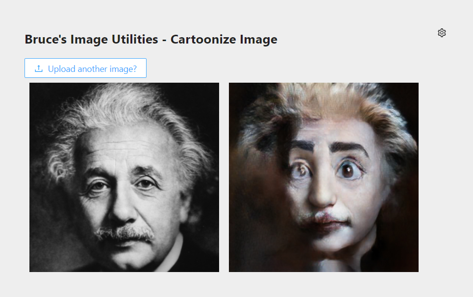

### Recent Personal Projects

## Play3
Experiment with superimposing images on a variety of 3D Shapes, [live demo here](https://zm2he.github.io/play3/index.html)
    

## Movie Awards
Search movies, and add favorite movies to nominataion list (up to 5), [live demo here](https://zm2he.github.io/movieawards/index.html)
     

## Image Repository
Image repository server allowing signed up users to upload, store, and search images, try it using [API swagger page](http://52.73.210.69/api-docs/)
     

## ImageUtil
Work in progress: a bunch of interesting tools for fiddling around with images, try it using [API swagger page](http://52.201.47.119/api-docs/).
     